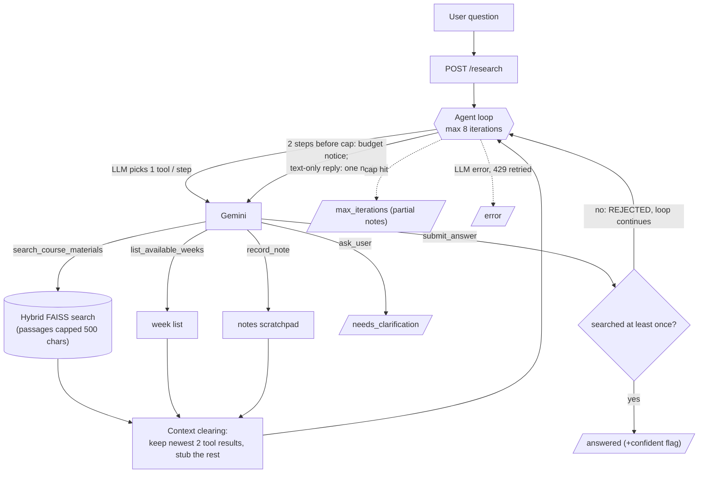

# Week 16 — Agentic `/research` feature (built on the W15 assistant)

**New feature: cross-source verification** (`POST /research`, `ai_assistant/app/agent.py`). The model researches a
question in a loop — search a week, read the result, decide to search another week / reword the query /
ask the user / submit — and only submits once it has evidence (`submit_answer` is rejected before the first
search; `confident=false` is the honest exit when evidence is missing). The W15 `/chat` endpoint is unchanged.

**Why a fixed pipeline is not enough:** which searches are needed (one week or several, a reworded retry after an
empty/off-topic result, or no search at all because the question is too vague) is only known after seeing each
previous result, so the app cannot script the steps in advance.

Single agent, one tool per step; W15 Gemini/FAISS code is reused as the tools.

## a. Context engineering technique
1. **Clearing tool results** (plus capping each retrieved passage to 500 chars, plus `record_note` as external notes).
2. **Where:** `_clear_stale_results()` in `ai_assistant/app/agent.py` runs after every iteration: only the 2 newest `search`/`list` results
   stay verbatim, older ones become `[tool result cleared ...]`.
3. **Problem solved:** a comparison over several weeks re-sends every earlier 4-passage retrieval on each of ~5–8 LLM calls,
   so context (and tokens) grow each step and stale passages distract the model. Clearing keeps context roughly flat; the
   model saves what matters via `record_note` (short note calls are never cleared) before the raw text disappears.

## b. Agentic pattern: single-agent loop
One agent, because the sub-tasks (search week A, search week B, compare) are sequential and share one small context, so
multi-agent buys little: *context isolation* isn't needed (results are already capped/cleared), *parallelization* would
save little on a 4–5 step task, and *specialization* isn't needed (the tools are simple). Multi-agent would add coordination
tokens and a handoff point of failure. Of the five structural failures, **context saturation** is handled by clearing;
**self-verification paradox** is reduced by the code-enforced "must have searched" guard rather than the model grading itself;
**single point of failure** remains (one agent) and is contained by the iteration cap and the `confident=false` exit.

## c. Evaluation harness (from scratch)
`ai_assistant/eval/run_eval.py` (`cd ai_assistant && python -m eval.run_eval`, needs API key) runs 8 queries (compare, lookup, not-in-corpus, missing week,
vague, 2 failure injections) and writes `ai_assistant/eval/results.md`: **task completion rate**, **tool-call correctness** (known tool,
correctly-typed non-empty args, expected tool used, enough searches), **trajectory length** vs a per-query bound,
**tokens per query**, and a **failure log** classed as *hard* (crash / step cap / no result), *soft* (finished but wrong or
over-confident) or *cascading soft* (a bad tool step — error, empty or malformed — earlier in the trajectory followed by a
wrong/over-confident answer). Logic is unit-tested offline with a scripted fake LLM: `cd ai_assistant && python -m pytest tests -q`.
Results: see [`ai_assistant/eval/results.md`](ai_assistant/eval/results.md) — latest run on `gemini-3.5-flash-lite`: 8/8 completed, 8/8 valid tool calls,
mean 4.6 iterations, ~5.2k tokens/query (lookups 3 iterations, comparison 7). Findings from the iterations of this eval: (1) the agent
sometimes replied in plain text instead of calling `submit_answer` -> added a one-time nudge; (2) on unanswerable queries it kept
searching until the step cap (a *hard failure*) -> added a budget notice two steps before the cap; (3) my first judge marked honest
"not covered" answers as over-confident -> judge now accepts an explicit admission. Caveat: results.json accumulates per-case, so a few
rows were produced before the last small prompt/budget changes; rerun `python -m eval.run_eval` to regenerate everything.
`gemini-2.5-flash` (the W15 default) has only 20 free requests/day, so set `GEMINI_MODEL=gemini-3.5-flash-lite` in `.env` to run the eval.

## Additional requirements
1. **Skill vs. agent:** the research loop could not be just a Skill, because a Skill only injects instructions and the
   iterate-on-results behaviour needs code that runs tools, enforces the guard, caps iterations and clears context; a Skill
   *would* suffice for static guidance such as answer formatting, so none was added.
2. **Token/cost accounting:** each run sums `usage_metadata.total_token_count` over every LLM call (`tokens` in the response
   and in the results table). Single-agent only, so no multi-agent baseline comparison applies.
3. **Failure injection:** `ResearchAgent(inject_failure=...)` makes search raise a 503-style error (`search_unavailable`) or
   return corrupt text (`malformed_search`); both are eval cases. Pass condition: the agent notices, does not guess, and submits
   `confident=false` saying it could not verify (an over-confident answer is logged as a cascading soft failure). Observed (`gemini-3.5-flash-lite`): with search down the agent retried 4 searches with reworded queries, then answered
   *"unable to verify ... search backend is currently unavailable (503)"*; with corrupt output it answered *"unable to find or verify ...
   did not return valid results"*. Neither produced a made-up dataset name. Cost: 6 iterations / ~5k tokens each (vs 3 / ~3.3k when healthy).
4. **Tool vs. agent boundary:** FAISS retrieval and the Gemini calls are modelled as bounded tool calls (single request,
   stateless, one result the loop can inspect), not agent-to-agent interactions, because nothing on the other side needs its own
   goals or multi-turn state; Ollama is only the plain `/chat` fallback and is not part of the loop.

Setup: put `GEMINI_API_KEY` in `.env` (this folder), then follow the W15 setup in [`ai_assistant/README.md`](ai_assistant/README.md) (`pip install -r requirements.txt`, `python ingest.py`,
`uvicorn app.main:app --port 8000`, run from `ai_assistant/`). Try: `curl -X POST localhost:8000/research -H 'content-type: application/json' -d '{"message":"Compare Week 12 and Week 14"}'`.
The free tier caps `gemini-2.5-flash` at ~20 requests/day; a full eval needs ~40, so use `gemini-3.5-flash-lite`.
